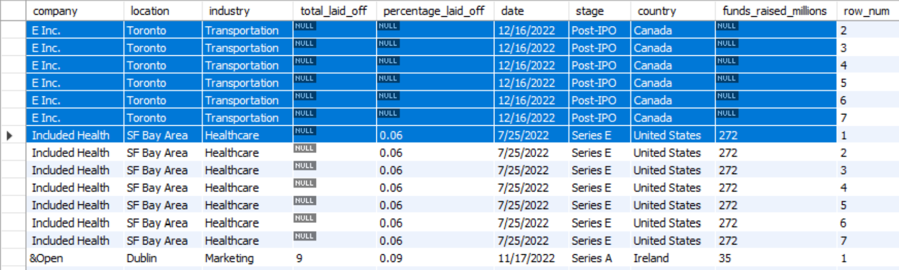

# 📊 SQL Layoffs Data Cleaning & Exploratory Data Analysis

## 📌 Project Overview

This project uses **MySQL** to clean and analyse a dataset containing information about company layoffs.

The project is divided into two stages:

1. **Data Cleaning** — identify and remove duplicate records, standardise inconsistent data, handle missing values, and remove unnecessary records and columns.
2. **Exploratory Data Analysis (EDA)** — analyse layoff trends by company, industry, country, year, company stage, and time period.

The project demonstrates how raw data can be transformed into a structured dataset suitable for further analysis.

---

## 🎯 Project Objectives

The main objectives of this project were to:

* Clean and standardise a raw layoffs dataset
* Identify and remove duplicate records
* Handle inconsistent categorical values
* Convert incorrectly formatted data types
* Identify and populate missing values where appropriate
* Remove records that did not contain useful layoff information
* Explore patterns and trends in company layoffs
* Use SQL aggregation and window functions to analyse the data
* Calculate rolling totals and yearly rankings

---
# 🧹 Part 1 — Data Cleaning

The first stage focuses on preparing the raw dataset for analysis.

The main cleaning steps were:

1. Remove duplicates
2. Standardise inconsistent data
3. Handle NULL and blank values
4. Remove unnecessary records and columns

---

## 1. Remove Duplicates

### Step 1 — Create a Staging Table

The original `layoffs` table was copied into a staging table so that the raw dataset could be preserved.

```sql
CREATE TABLE layoffs_staging
LIKE layoffs;

INSERT layoffs_staging
SELECT *
FROM layoffs;

SELECT *
FROM layoffs_staging;
```

---

### Step 2 — Identify Duplicate Records

A `ROW_NUMBER()` window function was used to assign a number to records sharing the same values across relevant columns.

```sql
SELECT *,
ROW_NUMBER() OVER(
    PARTITION BY company, industry, total_laid_off,
                 percentage_laid_off, `date`, stage,
                 country, funds_raised_millions
) AS row_num
FROM layoffs_staging;
```

Records with `row_num > 1` were identified as potential duplicates.



---

### Step 3 — Create a Table Containing Duplicate Records

A CTE was used to identify duplicate rows:

```sql
WITH duplicate_cte AS
(
    SELECT *,
    ROW_NUMBER() OVER(
        PARTITION BY company, industry, total_laid_off,
                     percentage_laid_off, `date`, stage,
                     country, funds_raised_millions
    ) AS row_num
    FROM layoffs_staging
)
SELECT *
FROM duplicate_cte
WHERE row_num > 1;
```


---

### Step 4 — Create a Second Staging Table

A second staging table was created to store the cleaned records together with the temporary `row_num` column.

```sql
CREATE TABLE layoffs_staging2 (
    company TEXT,
    location TEXT,
    industry TEXT,
    total_laid_off INT DEFAULT NULL,
    percentage_laid_off TEXT,
    `date` TEXT,
    stage TEXT,
    country TEXT,
    funds_raised_millions INT DEFAULT NULL,
    row_num INT
);
```

---

### Step 5 — Populate the Second Staging Table

```sql
INSERT INTO layoffs_staging2
SELECT *,
ROW_NUMBER() OVER(
    PARTITION BY company, industry, total_laid_off,
                 percentage_laid_off, `date`, stage,
                 country, funds_raised_millions
) AS row_num
FROM layoffs_staging;
```

---

### Step 6 — Delete Duplicate Records

```sql
DELETE
FROM layoffs_staging2
WHERE row_num > 1;
```

---

### Step 7 — Validate the Results

```sql
SELECT *
FROM layoffs_staging2;
```

The dataset was then checked to confirm that duplicate records had been removed.


---

# 2. Standardise the Data

After removing duplicates, the next step was to identify inconsistent formatting and values.

---

## Step 1 — Remove Extra Spaces from Company Names

```sql
SELECT company, TRIM(company)
FROM layoffs_staging2;
```

The `TRIM()` function was then used to remove unnecessary spaces:

```sql
UPDATE layoffs_staging2
SET company = TRIM(company);
```

---

## Step 2 — Standardise Industry Names

The distinct industry values were reviewed:

```sql
SELECT industry
FROM layoffs_staging2
ORDER BY 1;
```

Inconsistent values such as `Crypto Currency` and `CryptoCurrency` were identified.

They were standardised as `Crypto`:

```sql
UPDATE layoffs_staging2
SET industry = 'Crypto'
WHERE industry LIKE 'Crypto%';
```

The result was validated using:

```sql
SELECT DISTINCT industry
FROM layoffs_staging2;
```

---

## Step 3 — Standardise Location Names

The distinct location values were inspected:

```sql
SELECT DISTINCT location
FROM layoffs_staging2
ORDER BY 1;
```

Some location names contained encoding or spelling inconsistencies.

These values were standardised:

```sql
UPDATE layoffs_staging2
SET location = 'Dusseldorf'
WHERE location = 'Düsseldorf';

UPDATE layoffs_staging2
SET location = 'Malmo'
WHERE location = 'Malmö';

UPDATE layoffs_staging2
SET location = 'Florianopolis'
WHERE location = 'Florianópolis';
```

The values were then checked again:

```sql
SELECT DISTINCT location
FROM layoffs_staging2
ORDER BY 1;
```

---

## Step 4 — Standardise Country Names

The distinct country values were reviewed:

```sql
SELECT DISTINCT country
FROM layoffs_staging2
ORDER BY 1;
```

An inconsistent value was identified:

`United States.` → `United States`

```sql
UPDATE layoffs_staging2
SET country = 'United States'
WHERE country = 'United States.';
```

---

## Step 5 — Convert Date from Text to Date

The `date` column was originally stored as text.

### Convert the text into a date

```sql
UPDATE layoffs_staging2
SET `date` = STR_TO_DATE(`date`, '%m/%d/%Y');
```

The results were checked:

```sql
SELECT `date`
FROM layoffs_staging2;
```

### Change the column data type

```sql
ALTER TABLE layoffs_staging2
MODIFY COLUMN `date` DATE;
```

This allows the date field to be used reliably for time-based analysis.

---

# 3. Handle NULL and Blank Values

Missing values were investigated to determine whether they could be populated using information from other records.

---

## Identify Missing Industry Values

```sql
SELECT *
FROM layoffs_staging2
WHERE industry IS NULL
   OR industry = '';
```

Some companies had missing industry values in certain records.

For example, **Airbnb** was investigated to determine whether another record for the same company contained the missing information.

```sql
SELECT *
FROM layoffs_staging2
WHERE company = 'Airbnb';
```

---

## Use a Self Join to Identify Missing Values

A self join was used to compare records belonging to the same company:

```sql
SELECT t1.industry, t2.industry
FROM layoffs_staging2 t1
JOIN layoffs_staging2 t2
    ON t1.company = t2.company
WHERE (t1.industry IS NULL OR t1.industry = '')
  AND t2.industry IS NOT NULL;
```

This identified companies where the industry was available in another record.

The affected companies included:

* Airbnb
* Carvana
* Juul

---

## Standardise Blank Values to NULL

Blank industry values were first converted to `NULL`:

```sql
UPDATE layoffs_staging2
SET industry = NULL
WHERE industry = '';
```

The missing values were then populated using the corresponding non-null industry value from another record belonging to the same company:

```sql
UPDATE layoffs_staging2 t1
JOIN layoffs_staging2 t2
    ON t1.company = t2.company
SET t1.industry = t2.industry
WHERE t1.industry IS NULL
  AND t2.industry IS NOT NULL;
```

The results were validated afterwards.

---

# 4. Remove Unnecessary Data

The final cleaning step was to remove records and columns that were not useful for the analysis.

---

## Step 1 — Remove Records Without Layoff Information

Records where both `total_laid_off` and `percentage_laid_off` were missing did not provide useful information for analysing layoffs.

These records were identified using:

```sql
SELECT *
FROM layoffs_staging2
WHERE total_laid_off IS NULL
  AND percentage_laid_off IS NULL;
```

They were then removed:

```sql
DELETE
FROM layoffs_staging2
WHERE total_laid_off IS NULL
  AND percentage_laid_off IS NULL;
```

---

## Step 2 — Remove the Temporary `row_num` Column

The `row_num` column was only required during duplicate removal and was no longer needed.

```sql
ALTER TABLE layoffs_staging2
DROP COLUMN row_num;
```

The final cleaned dataset was checked:

```sql
SELECT *
FROM layoffs_staging2;
```

---

# 🔎 Part 2 — Exploratory Data Analysis

After cleaning the dataset, exploratory analysis was performed to identify patterns in layoffs.

---

## 1. Maximum Number of Employees Laid Off

```sql
SELECT MAX(total_laid_off)
FROM layoffs_staging2;
```

This identifies the largest reported number of employees laid off in a single record.

---

## 2. Maximum Layoff Percentage

```sql
SELECT MAX(percentage_laid_off)
FROM layoffs_staging2;
```

This identifies the highest reported percentage of a company's workforce that was laid off.

---

## 3. Companies with 100% Layoffs

Companies reporting a 100% layoff rate were identified and ordered by the number of employees laid off:

```sql
SELECT *
FROM layoffs_staging2
WHERE percentage_laid_off = 1
ORDER BY total_laid_off DESC;
```

The same companies were also examined according to funding raised:

```sql
SELECT *
FROM layoffs_staging2
WHERE percentage_laid_off = 1
ORDER BY funds_raised_millions DESC;
```

These queries allow the analysis to examine companies that reported shutting down their entire workforce and compare them by reported layoff size and funding.

---

## 4. Total Layoffs by Company

The total number of layoffs was aggregated by company:

```sql
SELECT company, SUM(total_laid_off)
FROM layoffs_staging2
GROUP BY company
ORDER BY 2 DESC;
```

This identifies companies with the largest cumulative reported layoffs in the dataset.

---

## 5. Time Period Covered by the Dataset

```sql
SELECT MIN(`date`), MAX(`date`)
FROM layoffs_staging2;
```

This establishes the period covered by the available data before interpreting time-based trends.

---

## 6. Total Layoffs by Industry

```sql
SELECT industry, SUM(total_laid_off)
FROM layoffs_staging2
GROUP BY industry
ORDER BY 2 DESC;
```

This compares the total reported layoffs across industries.

---

## 7. Total Layoffs by Country

```sql
SELECT country, SUM(total_laid_off)
FROM layoffs_staging2
GROUP BY country
ORDER BY 2 DESC;
```

This provides a geographic comparison of reported layoffs.

---

## 8. Total Layoffs by Year

```sql
SELECT YEAR(`date`) AS year,
       SUM(total_laid_off) AS total_laid_off
FROM layoffs_staging2
GROUP BY YEAR(`date`)
ORDER BY year DESC;
```

This allows the analysis to identify changes in reported layoffs over time.

---

## 9. Total Layoffs by Company Stage

```sql
SELECT stage,
       SUM(total_laid_off) AS total_laid_off
FROM layoffs_staging2
GROUP BY stage
ORDER BY total_laid_off DESC;
```

This compares reported layoffs across different company stages.

---

# 📈 10. Monthly Layoffs and Rolling Total

Monthly layoffs were first calculated:

```sql
SELECT SUBSTRING(`date`, 1, 7) AS `month`,
       SUM(total_laid_off) AS total_off
FROM layoffs_staging2
WHERE SUBSTRING(`date`, 1, 7) IS NOT NULL
GROUP BY `month`
ORDER BY `month`;
```

A **rolling cumulative total** was then calculated using a CTE and window function:

```sql
WITH Rolling_Total AS
(
    SELECT SUBSTRING(`date`, 1, 7) AS `month`,
           SUM(total_laid_off) AS total_off
    FROM layoffs_staging2
    WHERE SUBSTRING(`date`, 1, 7) IS NOT NULL
    GROUP BY `month`
)
SELECT `month`,
       total_off,
       SUM(total_off) OVER(ORDER BY `month`) AS rolling_total
FROM Rolling_Total;
```

This demonstrates the use of **CTEs and window functions** to perform cumulative time-series analysis.

---

# 🏆 11. Top Companies by Layoffs for Each Year

The total layoffs were first calculated for each company and year:

```sql
SELECT company,
       YEAR(`date`) AS years,
       SUM(total_laid_off) AS total_laid_off
FROM layoffs_staging2
GROUP BY company, YEAR(`date`)
ORDER BY total_laid_off DESC;
```

A `DENSE_RANK()` window function was then used to identify the top five companies for each year:

```sql
WITH Company_Year AS
(
    SELECT company,
           YEAR(`date`) AS years,
           SUM(total_laid_off) AS total_laid_off
    FROM layoffs_staging2
    GROUP BY company, YEAR(`date`)
),
Company_Year_Rank AS
(
    SELECT *,
           DENSE_RANK() OVER (
               PARTITION BY years
               ORDER BY total_laid_off DESC
           ) AS ranking
    FROM Company_Year
    WHERE years IS NOT NULL
)
SELECT *
FROM Company_Year_Rank
WHERE ranking <= 5;
```

This demonstrates how SQL window functions can be used to rank companies **within each year** rather than ranking the entire dataset globally.

---

# 💡 Key Analysis Areas

The exploratory analysis investigated several dimensions of the layoffs dataset:

| Analysis       | Question                                                                      |
| -------------- | ----------------------------------------------------------------------------- |
| Company        | Which companies reported the largest cumulative layoffs?                      |
| Industry       | Which industries recorded the highest total reported layoffs?                 |
| Country        | How did reported layoffs vary geographically?                                 |
| Year           | How did reported layoffs change over time?                                    |
| Company Stage  | How did reported layoffs differ across company stages?                        |
| Monthly Trend  | How did layoffs accumulate over the period?                                   |
| Annual Ranking | Which companies appeared among the highest reported layoffs within each year? |
| 100% Layoffs   | Which companies reported laying off their entire workforce?                   |

---

# 🧠 Key SQL Concepts Learned

This project provided practical experience with several SQL concepts, particularly:

### Data Cleaning

* Creating staging tables
* Removing duplicate records
* Standardising categorical data
* Handling `NULL` and blank values
* Converting data types
* Removing unnecessary records and columns

### Data Analysis

* Aggregation using `SUM()` and `MAX()`
* Grouping data with `GROUP BY`
* Filtering data with `WHERE`
* Sorting results using `ORDER BY`
* Joining a table to itself
* Common Table Expressions (CTEs)

### Advanced SQL

* `ROW_NUMBER()`
* `DENSE_RANK()`
* Window functions
* Rolling totals
* Partitioned ranking
* Date-based analysis

---

# ⚠️ Data Considerations

The results of this project should be interpreted as **reported layoffs within the dataset**, rather than a complete record of all layoffs.

The analysis is also dependent on the completeness and accuracy of the source data. Missing values were handled where possible, but some missing information could not be reliably reconstructed.

Therefore, the analysis is primarily **exploratory** and identifies patterns within the available data rather than establishing causal relationships.

---

# 🚀 Future Improvements

If I continued developing this project, I would extend the analysis by:

* Calculating layoff percentages by industry and country
* Comparing year-over-year changes
* Analysing monthly and quarterly trends
* Investigating relationships between funding and layoffs
* Analysing layoffs relative to company stage
* Creating additional metrics such as average layoffs per company
* Building a dashboard using **Power BI or Tableau**
* Reproducing the analysis using **Python/Pandas**
* Creating a reusable SQL script that runs the complete cleaning pipeline from the raw table

# 📚 References

* **Dataset:** [Dataset](https://github.com/AlexTheAnalyst/MySQL-YouTube-Series)
* **Learning Resource:** [Alex The Analyst — SQL Data Cleaning & Exploratory Data Analysis tutorial](https://www.youtube.com/watch?v=QYd-RtK58VQ&list=PLUaB-1hjhk8FE_XZ87vPPSfHqb6OcM0cF&index=21)

---

## 👤 Author

**Queenie Chong**

**Github: Meowcky**
